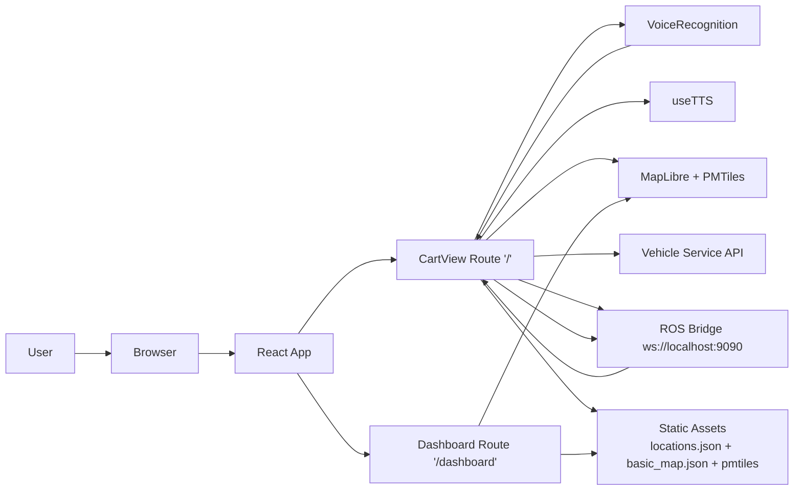
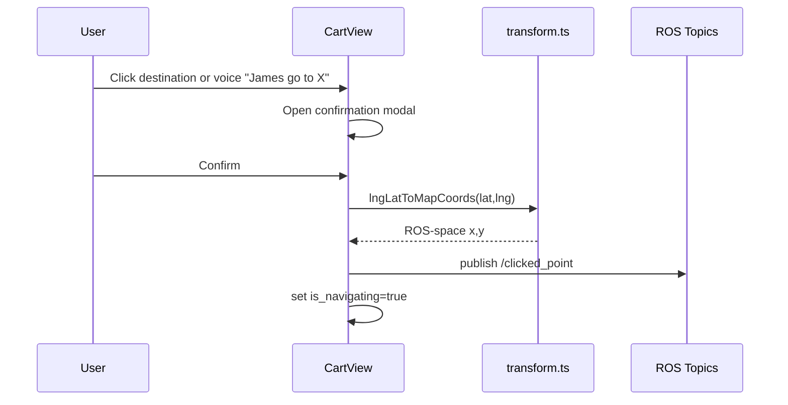
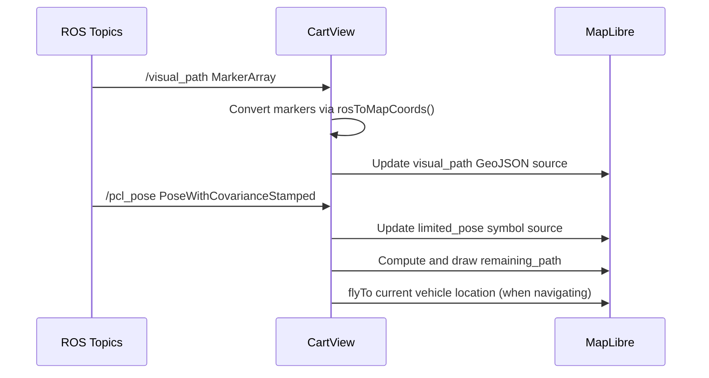

# Frontend Architecture Manual (JACart UI)

This document explains how the frontend is structured and how it works with ROS, mapping, voice control, and backend services.

## 1. High-Level Architecture Diagram

## 2. Runtime Entry and Route Structure

- App entry is `src/main.tsx`.
- React Router defines two routes:
- `/` -> `CartView` (primary operator/user screen)
- `/dashboard` -> `Dashboard` (monitoring view with cart cards)
- The app mounts into `#root` in `index.html`.

Notes:
- `src/App.tsx` exists but is not used by the router flow.

## 3. Frontend Layers and Responsibilities

### UI Layer (React + Ant Design)

- Main UX lives in `src/CartView.tsx`.
- Monitoring UX lives in `src/Dashboard.tsx`.
- Reusable pieces:
- `src/ui/TripInfoCard.tsx` for dashboard cards
- `src/ui/DevMenu.tsx` for development-only controls
- Styling:
- `src/styles/CartView.css`
- `src/styles/Dashboard.css`
- global CSS variables in `main.css`

### Integration Layer

- `src/topics.ts` is the ROS gateway:
- Opens WebSocket to ROS bridge (`ws://localhost:9090`)
- Defines all ROS topics used for subscribe/publish.
- `src/services/vehicleService.ts` is the HTTP service wrapper:
- Registers cart identity with backend
- Toggles help request state.

### Domain/Utility Layer

- `src/transform.ts` handles coordinate conversions:
- ROS frame <-> map longitude/latitude using projection matrices.
- `src/locations.json` is the source of truth for selectable destinations.
- `src/MessageTypes.d.ts` defines message typing contracts for ROS payloads.
- `src/useTTS.ts` encapsulates text-to-speech behavior.
- `src/VoiceRecognition.tsx` encapsulates wake-word and command parsing.

### Mapping/Assets Layer

- Map rendering is done with MapLibre.
- PMTiles protocol is enabled via `pmtiles` `Protocol()`.
- Style is loaded from `public/basic_map.json`.
- Vector map tiles come from `public/harrisonburg.pmtiles`.
- Marker image uses `public/osgeo-logo.png`.

## 4. Core State Model in CartView

`CartView` combines several state groups:

- Navigation state (`VehicleState`):
- `is_navigating`
- `reached_destination`
- `stopped`
- Modal/UI state:
- location info modal open/close
- confirmation modal open/close
- tutorial modal/tour open/close
- User action state:
- selected destination
- current destination name
- help requested flag
- Voice state:
- live transcript/listening from `useSpeechRecognition`.

This state drives:
- which buttons appear (Stop vs Resume),
- which destination is highlighted,
- when speech confirmation is spoken,
- and when map path overlays are updated/cleared.

## 5. Data Flow: Main Operational Paths

### A. Select Destination and Start Navigation

What happens internally:
- Destination can come from list click, map marker click, or voice command.
- On confirmation, `navigateToLocation()` calls `navigateTo()`.
- `navigateTo()` converts map coordinates to ROS frame and publishes `clicked_point`.

### B. Vehicle Position and Path Rendering

What happens internally:
- `visual_path` subscription builds a full line.
- `limited_pose` subscription updates live position and calculates nearest point on path.
- Remaining path is sliced from closest index onward.

### C. Emergency Stop and Resume

- Stop flow (`STOP` voice command or Stop button):
- Sends `/nav_cmd` with negative velocity.
- Sends `/set_manual_control`.
- Sends `/direct_brake` with max value `255`.
- Publishes stopped state to `/vehicle_state`.
- Starts interval re-sending stop commands every ~1900 ms for redundancy.

- Resume flow:
- Clears stop interval.
- Publishes manual control release on `/set_manual_control`.
- Publishes resumed state on `/vehicle_state`.
- Updates local UI state to show navigating mode.

### D. Voice Command Flow

- `VoiceRecognition` listens continuously.
- Wake word format: `James *`.
- Fuzzy matching (`Fuse.js`) maps spoken text to canonical actions:
- `STOP`, `HELP`, `RESUME`, `GO TO`, `CONFIRM`, `CANCEL`
- `GO TO` uses fuzzy matching against `locations.json` names.
- Parsed command is emitted to `CartView.handleCommand()`.
- `CartView` performs the actual command side effects.

### E. Help Request Flow

- Help button or `HELP` voice command calls `vehicleService.requestHelp("James")`.
- API response (`{ helpRequested: boolean }`) updates UI text:
- `Press to Request Help` or `Help Requested`.

## 6. ROS Topic Contract Used by Frontend

From `src/topics.ts`:

- Subscribed/consumed by frontend:
- `/visual_path`
- `/pcl_pose`
- `/vehicle_state`
- `/zed/zed_node/rgb/image_rect_color`

- Published by frontend:
- `/clicked_point`
- `/set_manual_control`
- `/nav_cmd`
- `/direct_brake`
- `/vehicle_state` (state updates on stop/resume paths)

This is the key integration boundary with AI-nav/robotics services.

## 7. Camera Image Handling

- Left camera topic publishes image bytes in Base64.
- Frontend decodes bytes, converts BGRA -> RGBA, writes to a canvas, then sets `img#camera-image` source as data URL.
- Result: a live camera panel in the sidebar.

## 8. Dashboard Route Architecture (`/dashboard`)

- `Dashboard.tsx` creates a map with same PMTiles style.
- Uses local mock `carts` array (not ROS-driven yet in this component).
- Each cart is displayed in `TripInfoCard`.
- `TripInfoCard` supports:
- focusing map on cart coordinates,
- optional click-to-navigate back to root route (`/`).

## 9. Configuration and Environment

- `.env.example` exposes `VITE_ZEROTIER_IP`.
- `vehicleService` currently has hardcoded default API base:
- `https://35.153.174.48/api/vehicles/`
- If `VITE_ZEROTIER_IP` is set, registration includes websocket URL using that IP.

## 10. Dev and Build Tooling

- Build/dev tool: Vite (`vite.config.ts`).
- React plugin enabled.
- Source maps enabled for dev and production builds.
- Dev server opens browser automatically.

## 11. End-to-End "How It All Comes Together"

1. User loads app route `/` and sees destinations, map, and controls.
2. Frontend initializes MapLibre + PMTiles style and registers cart with backend API.
3. Frontend opens ROS websocket (from `topics.ts`) and subscribes to pose/path/state/image topics.
4. User selects a destination (click or voice), confirms, and frontend publishes `/clicked_point`.
5. AI-nav/backend stack computes and publishes path and vehicle pose updates.
6. Frontend continuously redraws:
- full path (`visual_path`),
- remaining path (`remaining_path`),
- cart marker (`limited_pose`),
- camera image panel.
7. User can interrupt with emergency stop; frontend repeatedly publishes redundant stop commands until resume.
8. User can request help; frontend toggles remote help state via API.
9. Dashboard route can be used for high-level monitoring with card-based overview.

## 12. File Map (Quick Reference)

- Entry/routing: `src/main.tsx`
- Main operator UI: `src/CartView.tsx`
- Dashboard UI: `src/Dashboard.tsx`
- Voice parser: `src/VoiceRecognition.tsx`
- TTS hook: `src/useTTS.ts`
- ROS integration: `src/topics.ts`
- Coordinate transforms: `src/transform.ts`
- HTTP backend integration: `src/services/vehicleService.ts`
- Type contracts: `src/MessageTypes.d.ts`
- Destination catalog: `src/locations.json`
- Dashboard card: `src/ui/TripInfoCard.tsx`
- Dev tools drawer: `src/ui/DevMenu.tsx`

## 13. Known Design Constraints (Important for Manual Readers)

- ROS websocket URL is fixed to `ws://localhost:9090` in frontend code.
- API server defaults to a hardcoded remote IP unless overridden in dev menu.
- `Dashboard` currently uses static/mock cart data.
- `src/App.tsx` is currently not part of the active app flow.
- Some stop/resume state publishing is duplicated for safety; behavior is intentionally redundant.

# JACart2 / ui
A user interface for autonomous navigation of a JACART.

# Important Tools/Libraries Used
- [React](https://react.dev/): for implementing ui elements declaratively.
- [Ant Design](https://ant.design/components/overview/): to provide accessible UI components across the app.
- [Maplibre](https://maplibre.org/): for rendering the map
- [React Map GL](https://visgl.github.io/react-map-gl/): react wrapper for Maplibre
- [OpenStreetMap](https://www.openstreetmap.org/#map=17/38.43711/-78.87157): Current map data was directly exported from OpenStreetMap
- [OSM Liberty](https://github.com/maputnik/osm-liberty): Open Source style for the map. Copied and modified in [public/osm-liberty/](public/osm-liberty/)
- [pmtiles](https://www.npmjs.com/package/pmtiles): Provides protocol that enables loading map from a singular static file.
- [Tilemaker](https://github.com/systemed/tilemaker/): Convert .osm.pbf file to .pmtiles
- [Osmconvert](https://wiki.openstreetmap.org/wiki/Osmconvert): Convert .osm (exported from OSM) file to .osm.pbf
- [react-speech-recognition](https://www.npmjs.com/package/react-speech-recognition): A React library for browser-based speech recognition.
- [fuse.js](https://www.fusejs.io/): A fuzzy-search library to interpret partial or mispronounced commands.

# Prerequisites
- [Node.js](https://nodejs.org/en)

# Voice Commands
- Command word: Say __"James"__ before saying any commands for the cart to start listening.
- Navigation Command: Say __"go to [location]"__ and the cart will begin navigation once the selection is confirmed. 
- Confirmation Command: Say __"confirm"__ once a location is selected to begin navigation.
- Cancellation Command: Say __"cancel"__ to deselect a location.
- Emergency Stop Command: Say __"stop"__ to initiate a remote emergency stop during navigation.
- Resume Command: Say __"resume"__ to resume cart navigation after it has been stopped.

# Installation & Running
`npm install`
`npm install regenerator-runtime`
`npm install fuse.js`
`npm run dev`
